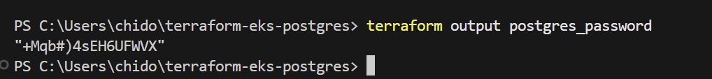
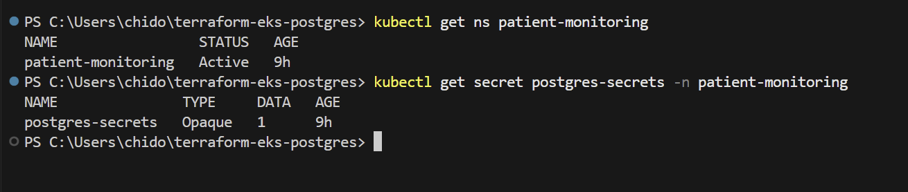
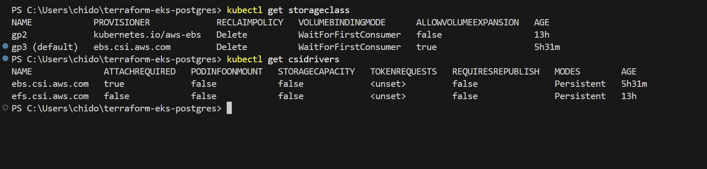
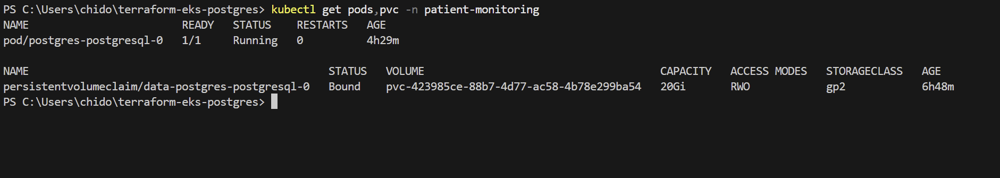

# PostgreSQL Kubernetes Assessment

This repository contains Terraform and Helm configurations to deploy a minimal PostgreSQL database into an AWS EKS cluster for a patient remote-monitoring system. It demonstrates Infrastructure as Code (IaC), Kubernetes best practices, security measures, and a GitOps mindset.

---

## Table of Contents

1. [Overview](#overview)
2. [Architecture & Approach](#architecture--approach)
3. [Security Considerations](#security-considerations)
4. [GitOps Extension](#gitops-extension)
5. [Trade-offs](#trade-offs)
6. [Validation](#validation)
7. [Screenshots](#screenshots)

---

## Overview

* **VPC & Networking:** Two-AZ VPC with public and private subnets, NAT gateway, and DNS support.
* **EKS Cluster:** Kubernetes v1.27 with two managed node groups, control-plane logging, and IAM mapping via Access Entries.
* **Storage:** AWS EBS CSI driver installed as an add-on, default `gp3` StorageClass for dynamic provisioning.
* **Kubernetes Resources:**

  * `patient-monitoring` namespace
  * `postgres-secrets` Secret (Base64-encoded password)
  * Helm release of Bitnami PostgreSQL with persistence, resource requests/limits, and atomic installs.

---

## Architecture & Approach

I leveraged the **Terraform AWS modules** for reliable, reusable infrastructure:

* **VPC Module:** Creates a secure network foundation with NAT and DNS.
* **EKS Module:** Provisions a managed cluster and node groups, configures logging and IAM.
* **Helm Provider:** Deploys the Bitnami PostgreSQL chart with minimal overrides.

Using community modules and charts ensures stability, while Terraform’s state management provides reproducibility.

---

## Security Considerations

1. **Credentials Management**

   * Password is generated by the `random_password` Terraform resource.
   * Injected into Kubernetes via a `kubernetes_secret`, avoiding plaintext in Git.
2. **Resource Constraints**

   * Defined CPU/memory `requests` and `limits` to prevent resource contention.
3. **Namespace Isolation**

   * All PostgreSQL resources live in the `patient-monitoring` namespace, isolating them from other workloads.
4. **IAM Least-Privilege**

   * Mapped IAM user to cluster via Access Entries with only `cluster-admin` scope for demonstration.

---

## GitOps Extension

This repository is fully declarative. With a GitOps tool like **ArgoCD** or **Flux**, you would:

1. Point the tool at the `main` branch of this repo.
2. Configure it to apply Terraform and Helm manifests automatically.
3. On every merge to `main`, the cluster state is reconciled to match Git.

This ensures drift detection and self-healing of your infrastructure.

---

## Trade-offs

* **Bitnami Chart vs. Custom StatefulSet:** Faster setup and community support at the cost of deep customizability.
* **Single NAT Gateway:** Cost-effective but introduces a potential egress bottleneck.

---

## Validation

Run these commands to verify the deployment end-to-end:

```bash
# 1. Check generated password
terraform output postgres_password
```



```bash
# 2. Confirm namespace and secret
kubectl get ns patient-monitoring
kubectl get secret postgres-secrets -n patient-monitoring
```



```bash
# 3. Verify StorageClass and CSI driver
kubectl get storageclass
kubectl get csidrivers
```



```bash
# 4. Check pods, and PVC
kubectl get pods,pvc -n patient-monitoring
```




---

## Screenshots

1. **Terraform Output**\\

2. **VPC Overview**\\

3. **EKS Cluster Overview**\\

4. **StorageClass & CSI Driver**\\

5. **Pods & PVC**\\

### Advanced Validation (optional)

6. **Control-Plane Logging**\\

7. **PersistentVolume Details**\\
