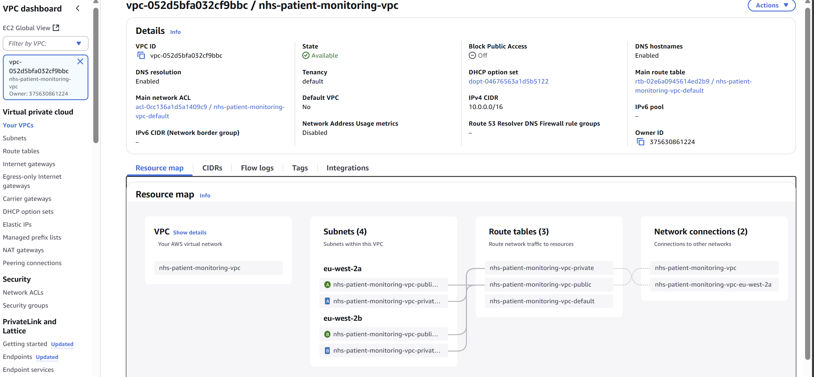
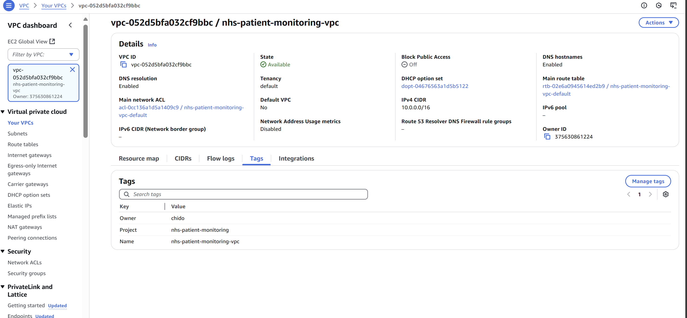
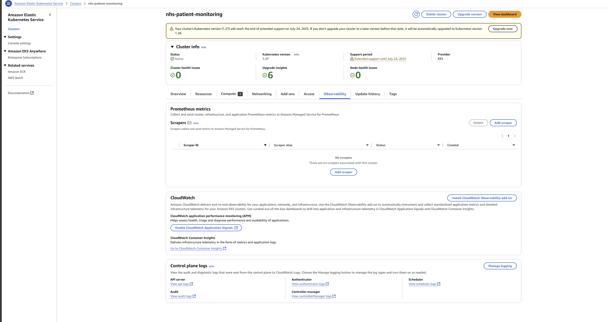
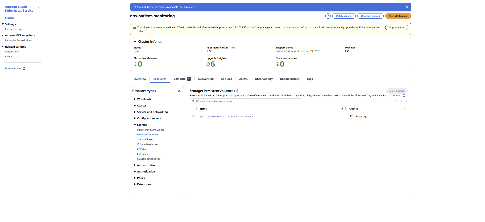
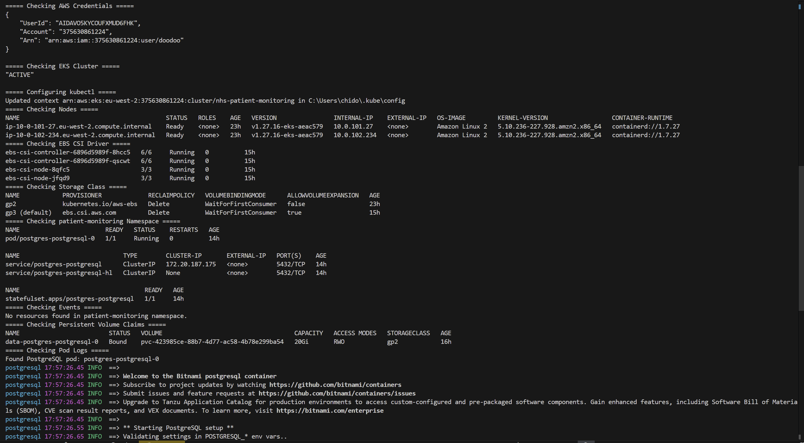
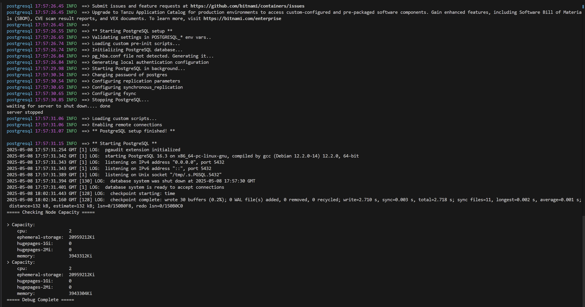

# PostgreSQL on Kubernetes for NHS Patient Monitoring

This repository provides a complete solution for deploying a PostgreSQL database on Amazon's Kubernetes service (EKS) to support an NHS patient-monitoring system. The implementation follows modern cloud-native practices including Infrastructure as Code (IaC), Kubernetes orchestration, security best practices, and GitOps principles.

## What is this project for?

This solution creates the necessary infrastructure to securely host a PostgreSQL database that would store sensitive patient telemetry data collected from wearable devices. While this focuses specifically on the database component, it's designed to integrate with a larger patient monitoring system for NHS Trusts.

---
## Table of Contents
1. [Prerequisites](#prerequisites)
2. [Overview](#overview)
3. [Architecture & Approach](#architecture--approach)
4. [Deployment Process](#deployment-process)
5. [Security Considerations](#security-considerations)
6. [GitOps Extension](#gitops-extension)
7. [Trade-offs](#trade-offs)
8. [Validation](#validation)
9. [Future Enhancements](#future-enhancements)
10. [Debug Script](#debug-script--powershell)

---
## Prerequisites

Before you begin, make sure you have these tools installed and properly configured on your computer:

- **AWS CLI**: Command line tool to interact with AWS services. You'll need permissions to create and manage VPC, EKS, IAM, and EC2 resources.
- **Terraform** ≥ 1.5.0: Infrastructure as Code tool that lets you define cloud resources in configuration files.  
- **kubectl**: Command line tool for interacting with Kubernetes clusters.
- **Helm**: Package manager for Kubernetes that helps you install and manage applications.
- **Git**: Version control system for tracking changes and collaborating.

You can verify your installations with these commands:

```bash
aws --version
terraform --version
kubectl version --client
helm version
git --version
```

---
## Overview

This solution sets up the following components:

- **VPC & Networking:** 
  - A Virtual Private Cloud (VPC) spanning multiple Availability Zones for high availability
  - Public and private subnets (database resources will be in private subnets for security)
  - NAT gateway for outbound internet connectivity from private subnets
  - DNS support for service discovery

- **EKS Cluster:** 
  - Amazon's managed Kubernetes service (version 1.27)
  - Two node groups (collections of EC2 instances) for redundancy
  - Control-plane logging for audit and troubleshooting
  - IAM mapping to control who can access the cluster

- **Storage:** 
  - AWS EBS CSI driver add-on to allow Kubernetes to use AWS storage
  - Default `gp3` StorageClass for automatically provisioning storage when needed

- **Kubernetes Resources:**  
  - `patient-monitoring` namespace for logical isolation
  - `postgres-secrets` Secret for secure credential storage
  - Bitnami PostgreSQL deployed via Helm with persistence and resource limits

---
## Architecture & Approach

### Why This Approach?

This implementation uses:

- **Terraform AWS Modules**: These are pre-built, well-tested building blocks for AWS infrastructure that follow best practices. Using modules speeds up development and reduces errors compared to writing everything from scratch.

- **Helm Provider**: Helm is a package manager for Kubernetes that makes it easy to install and upgrade complex applications like PostgreSQL. The Helm provider lets Terraform manage Helm releases.

- **Random Password Resource**: This automatically generates a secure, random password and stores it as a Kubernetes Secret, avoiding hardcoded credentials.

### How the Components Fit Together

1. **Terraform** creates the underlying AWS infrastructure (VPC, EKS cluster)
2. **EBS CSI Driver** connects AWS storage to Kubernetes
3. **Kubernetes Namespace** isolates PostgreSQL resources
4. **Helm** deploys the PostgreSQL database with proper configuration
5. **Kubernetes Secret** securely stores the database password

---
## Deployment Process

This section guides you through publishing your local code to GitHub and then deploying the infrastructure. Each step includes explanation for newcomers.

1. **Initialize and Commit Locally**  
   If you have not already, start version control and save your work:  
   ```bash
   # Initialize a new Git repository in your project folder
   git init
   
   # Add all your files (Terraform, Helm, README, screenshots)
   git add .
   
   # Create your first commit with a meaningful message
   git commit -m "Initial commit: add Terraform IaC, Helm configs, and docs"
   ```  
   - `git init` creates a `.git` folder to track your changes.  
   - `git add .` stages all current files for commit.  
   - `git commit` saves a snapshot of your project with a message.

2. **Create the GitHub Repository**  
   A remote repository is where your code lives online for collaboration and backup:  
   1. Go to [GitHub.com](https://github.com/) and sign in.  
   2. Click the **+** icon (top-right) → **New repository**.  
   3. Enter **Repository name**: `nhs-assessment-k8s`.  
   4. Leave all **Initialize** boxes unchecked (no README or .gitignore).  
   5. Click **Create repository**.  
   - You will see instructions for pushing existing code.

3. **Link and Push Your Code**  
   Connect your local repo to GitHub and upload your commit:  
   ```bash
   # Copy the SSH (or HTTPS) URL from GitHub, then:
   git remote add origin git@github.com:YOUR-USERNAME/nhs-assessment-k8s.git
   
   # Push your local master (or main) branch to GitHub
   git push -u origin master
   ```  
   - `git remote add origin <URL>` tells Git where to send your code online.  
   - `git push -u origin master` uploads your code and remembers the branch for future pushes.

4. **Verify Your Repository**  
   - Open your repository page on GitHub.  
   - Ensure you see all folders and files, including `.tf` files, `README.md`, and your `screenshots/` directory.

5. **Deploy to AWS**  
   Now that your code is versioned online, let's create the actual AWS resources:  
   ```bash
   terraform init        # Downloads provider plugins and modules
   terraform plan        # Shows what will be created or changed
   terraform apply       # Applies the plan, creating your VPC, EKS, etc.
   ```  
   - `terraform init` prepares your directory for Terraform operations.
   - `terraform plan` shows a preview of changes before applying them.
   - `terraform apply` creates the actual resources in AWS.
   - Approve the plan when prompted by typing `yes`.

6. **Configure kubectl Access**  
   Tell `kubectl` how to talk to your new EKS cluster:  
   ```bash
   aws eks update-kubeconfig --region eu-west-2 --name nhs-patient-monitoring
   kubectl get nodes    # Lists the worker nodes, confirming connectivity
   ```  
   - `update-kubeconfig` writes cluster credentials to your local configuration.  
   - The `kubectl get nodes` command should show your EKS nodes in `Ready` state.

---
## Security Considerations

This implementation includes several security measures critical for healthcare data:

1. **Credentials Management:**  
   - Using `random_password` Terraform resource ensures strong, unique passwords.
   - Kubernetes Secret securely stores credentials and makes them available only to authorized services.
   - No hardcoded passwords in code or configuration files.

2. **Resource Constraints:**  
   - CPU and memory requests & limits prevent a single application from consuming all resources.
   - This improves stability and acts as a security measure against certain denial-of-service scenarios.

3. **Namespace Isolation:**  
   - Dedicated namespace (`patient-monitoring`) creates a boundary around database resources.
   - Makes it easier to apply security policies and access controls.

4. **IAM Least-Privilege:**  
   - IAM mapping via Access Entries restricts who can access the Kubernetes cluster.
   - Following the principle of least privilege - only grant the permissions needed.

---
## GitOps Extension

### What is GitOps?

GitOps is an operational framework that takes DevOps best practices and applies them to infrastructure automation. With GitOps:
- Your Git repository becomes the single source of truth for infrastructure configuration
- Changes to infrastructure go through Git (pull requests, reviews, etc.)
- Automated systems ensure the actual infrastructure matches what's in Git

### How to Implement GitOps with this Repository

This repository is already structured for GitOps:  
1. Point a GitOps tool like ArgoCD or Flux at the `main` branch.
2. The tool will automatically sync Terraform & Helm manifests.
3. Any drift between desired state (Git) and actual state (infrastructure) will be detected and corrected.

### Benefits for NHS

For an NHS Trust, GitOps provides:
- Audit trail of all infrastructure changes
- Easier compliance with healthcare regulations
- Faster recovery in case of issues
- Reduced human error during deployments

---
## Trade-offs

Understanding trade-offs helps make informed decisions about the infrastructure:

- **Bitnami Chart vs. Custom StatefulSet:** 
  - **Choice Made**: Using Bitnami's PostgreSQL Helm chart
  - **Pros**: Faster deployment, battle-tested configuration, regular security updates
  - **Cons**: Less customization than building a custom StatefulSet from scratch

- **Single NAT Gateway:** 
  - **Choice Made**: Using one NAT Gateway for all Availability Zones
  - **Pros**: More cost-effective, simpler configuration
  - **Cons**: Single point of failure for outbound internet connectivity

---
## Validation

After deployment, you can verify everything is working correctly with these commands:

### Basic Checks
```bash
# 1. Check generated password
terraform output postgres_password
```


```bash
# 2. Confirm namespace and secret
kubectl get ns patient-monitoring
kubectl get secret postgres-secrets -n patient-monitoring
```


```bash
# 3. Verify StorageClass and CSI driver
kubectl get storageclass
kubectl get csidrivers
```


```bash
# 4. Check pods, and PVC
kubectl get pods,pvc -n patient-monitoring
```


### Extended Checks
1. **VPC Overview**  

 

   
2. **EKS Cluster Overview**  
   
3. **Control-Plane Logging**  
   
4. **PersistentVolume Details**  
   

---
## Future Enhancements

For a production NHS environment, consider these additional features:

- **Backups & Disaster Recovery:** 
  - Automated database backups
  - Point-in-time recovery capabilities
  - Cross-region replication for catastrophic failure scenarios

- **Monitoring:** 
  - Prometheus for metrics collection
  - Grafana dashboards for visualization
  - Alerts for abnormal database behavior

- **Security Hardening:** 
  - Data encryption at rest and in transit
  - Network policies to restrict pod-to-pod communication
  - Comprehensive audit logging

- **High Availability:** 
  - Streaming replication for better fault tolerance
  - Read replicas to improve performance and availability

---
## Debug Script (PowerShell)

If you encounter issues, this PowerShell script can help diagnose common problems:

```powershell
Write-Output "===== Checking AWS Credentials ====="
aws sts get-caller-identity

Write-Output "===== Checking EKS Cluster ====="
aws eks describe-cluster --name nhs-patient-monitoring --query "cluster.status"

Write-Output "===== Configuring kubectl ====="
aws eks update-kubeconfig --region eu-west-2 --name nhs-patient-monitoring

Write-Output "===== Checking Nodes ====="
kubectl get nodes -o wide

Write-Output "===== Checking EBS CSI Driver ====="
kubectl get pods -n kube-system | Where-Object { $_ -match "ebs-csi" }

Write-Output "===== Checking StorageClass ====="
kubectl get storageclass

Write-Output "===== Checking Namespace ====="
try { kubectl get all -n patient-monitoring } catch { Write-Output "Namespace not found" }

Write-Output "===== Checking Events ====="
try { kubectl get events -n patient-monitoring --sort-by='.lastTimestamp' } catch { Write-Output "No events" }

Write-Output "===== Checking PVCs ====="
try { kubectl get pvc -n patient-monitoring } catch { Write-Output "No PVCs" }

Write-Output "===== Checking Pod Logs ====="
try {
  $pod = kubectl get pods -n patient-monitoring -l app.kubernetes.io/name=postgresql -o jsonpath="{.items[0].metadata.name}"
  if ($pod) { kubectl logs -n patient-monitoring $pod } else { kubectl get events -n patient-monitoring }
} catch { Write-Output "Error fetching logs" }

Write-Output "===== Checking Node Capacity ====="
kubectl describe nodes | Select-String -Pattern "Capacity:" -Context 0,5

Write-Output "===== Debug Complete ====="
```


